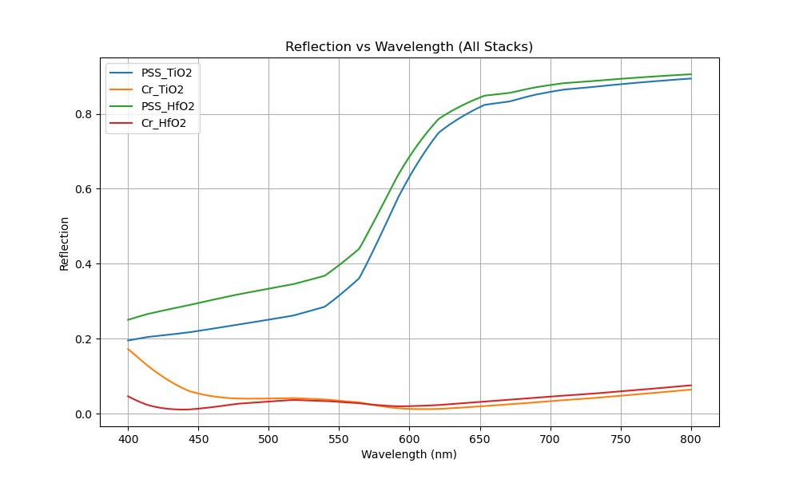
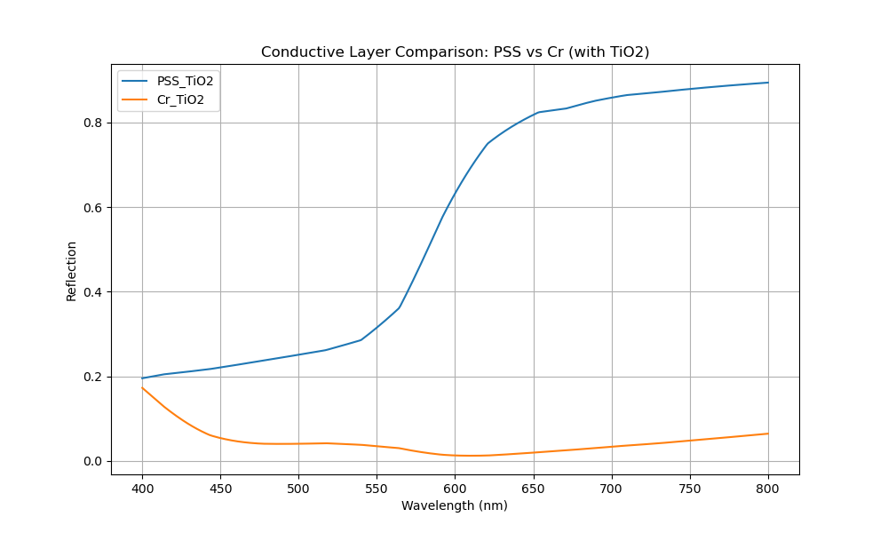
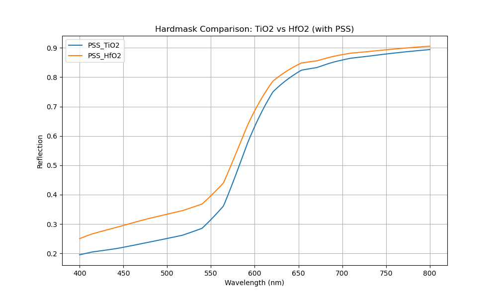

# Lumerical STACK Simulation Report

## 1. Model Overview
This report summarizes the 1D planar film stack optical modeling for focus and leveling research.

## 2. Summary Statistics
| Stack Name | Avg Reflection | Max Reflection | Min Reflection | Oscillation Amp | Peak Count |
|------------|----------------|----------------|----------------|-----------------|------------|
| PSS_TiO2 | 0.5641 | 0.8942 | 0.1952 | 0.6989 | 0 |
| Cr_TiO2 | 0.0434 | 0.1725 | 0.0121 | 0.1604 | 1 |
| PSS_HfO2 | 0.6124 | 0.9057 | 0.2504 | 0.6553 | 0 |
| Cr_HfO2 | 0.0357 | 0.0756 | 0.0110 | 0.0646 | 1 |

## 3. Key Analysis Insights
- Conductive layer (PSS vs Cr) significantly shifts average reflectivity by 52.1%.
- Hardmask material has minor impact on average reflectivity.

## 4. Visualizations

## 5. Limitations & Future Work
- Model is limited to 1D planar infinite layers.
- Materials HSQ, SOC, PSS use approximate dispersive models.
- Ultra-thin Cr (5nm) may show sensitive behavior depending on material model accuracy.
- Future work: FDTD for 3D structures, angle scans, and sensitivity analysis.
