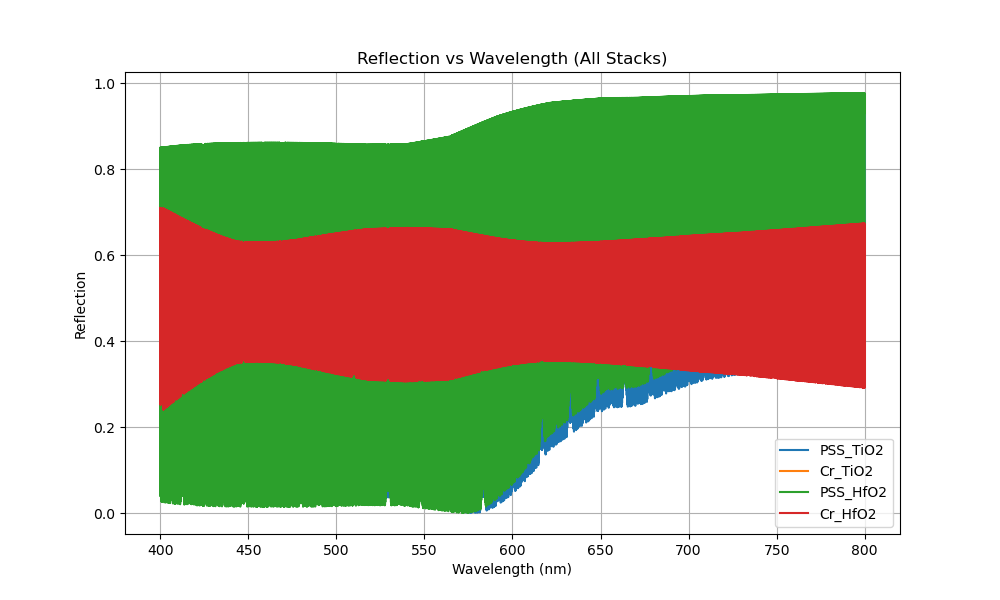
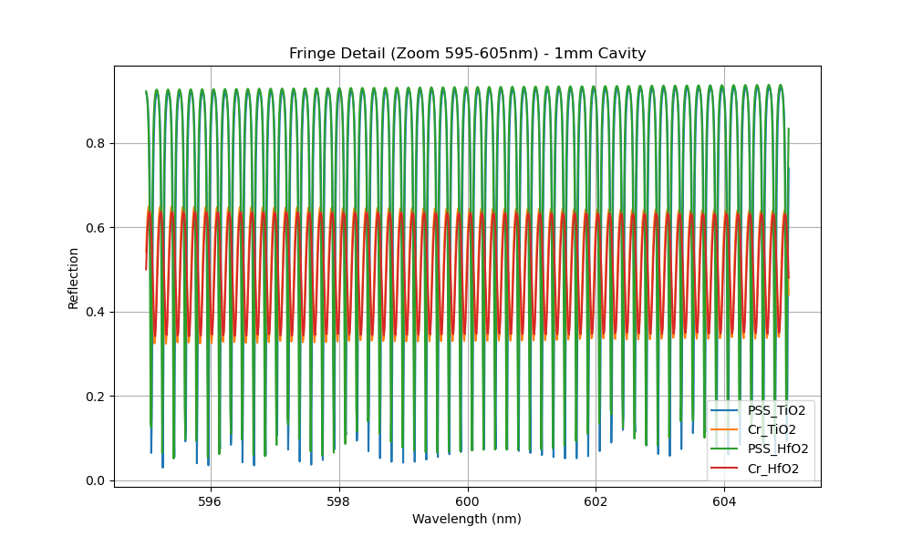
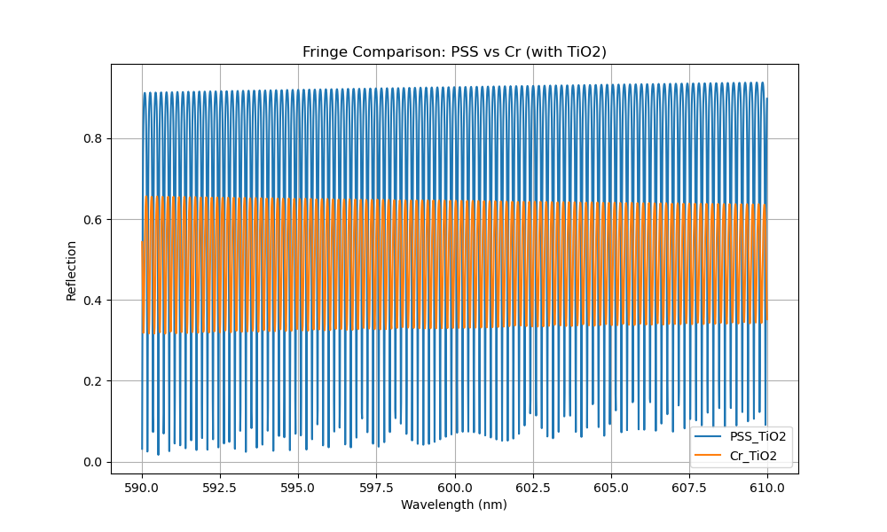

# Lumerical STACK Simulation Report

## 1. Model Overview
This report summarizes the 1D planar film stack optical modeling for focus and leveling research.
**New Feature**: External 50% Reflector with 1mm Air Gap forming a multi-cavity coupled system.

## 2. Summary Statistics & Fringe Analysis
| Stack Name | Avg R | Max R | Visibility | Fringe Period (nm) | Aliasing Risk | Peak Count |
|------------|-------|-------|------------|--------------------|---------------|------------|
| PSS_TiO2 | 0.7280 | 0.9736 | 0.9995 | 0.1599 | False | 2502 |
| Cr_TiO2 | 0.5198 | 0.7846 | 0.7344 | 0.1599 | False | 2502 |
| PSS_HfO2 | 0.7453 | 0.9768 | 0.9999 | 0.1599 | False | 2502 |
| Cr_HfO2 | 0.5138 | 0.7093 | 0.4939 | 0.1599 | False | 2501 |

## 3. Key Analysis Insights
- Conductive layer (PSS vs Cr) significantly shifts average reflectivity by 20.8%.
- Hardmask material has minor impact on average reflectivity.

## 4. Visualizations
### Broadband Spectrum

### High-Frequency Fringe Detail (600nm Zoom)

### Component Comparisons

## 5. Limitations & Future Work
- Model includes 1mm air gap, requiring very high resolution (0.01nm).
- FDTD visualization of 1mm gap is not practical; results are based on STACK analytical solver.
- Future work: Analysis of phase shift and its impact on leveling precision.
