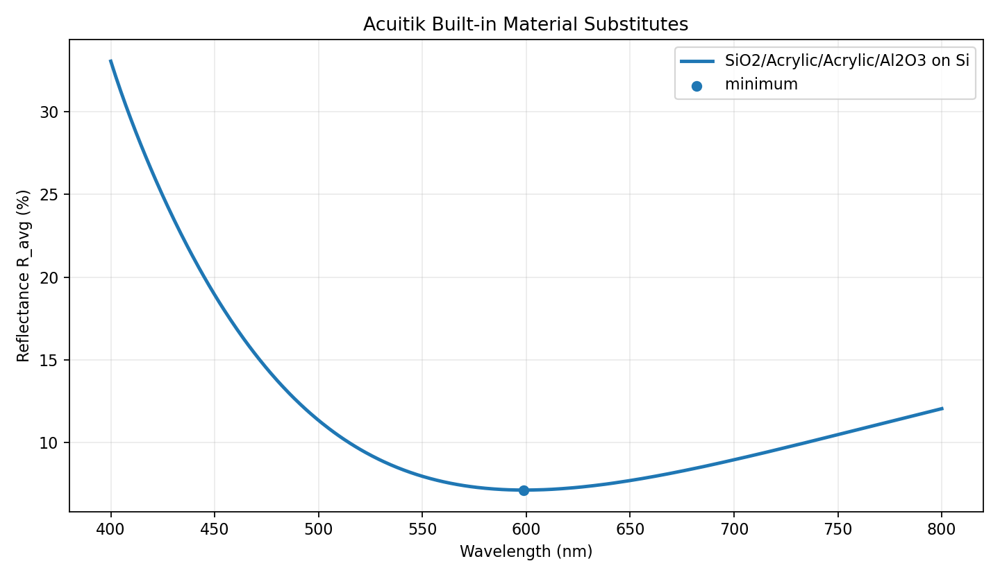
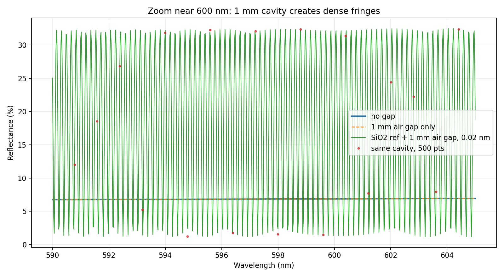
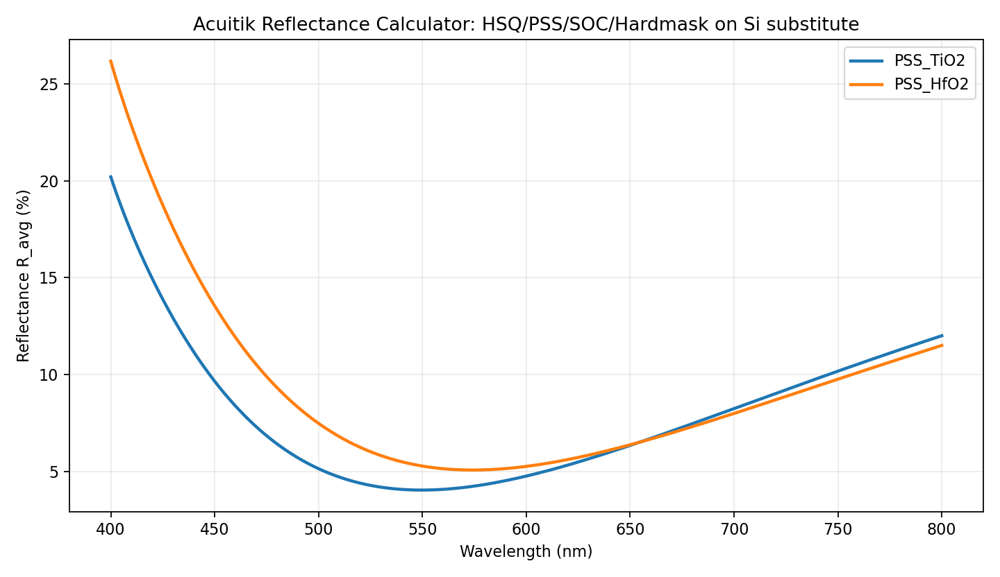

# Acuitik Reflectance Calculator 20260706

## 一句话结论

使用 Acuitik 薄膜反射率计算器对 `HSQ / PSS / SOC / TiO2(or HfO2) / substrate` 做 400-800 nm 垂直入射反射谱计算；按“网页内置材料优先”的口径，替代栈为 `SiO2 / Acrylic / Acrylic / Al2O3 / Si`，最低反射率约 `7.13% @ 598.8 nm`。

## 背景

目标膜层来自 `../../../work/05_reference_materials/03_Common_Docs/ChatGPT_Prompt.txt`：

| 层 | 目标材料 | 采用厚度 |
|---|---:|---:|
| 成像层 | HSQ | 30 nm |
| 导电放电层 | PSS | 5 nm |
| 有机平坦化层 | SOC | 45 nm |
| 金属氧化物硬掩模 | TiO2 / HfO2 | 20 nm |
| 器件基底 | Cu / SiN | 由网页工具替换为 Si |

## 输入口径

### 网页内置材料替代版

该版本优先使用 Acuitik 网页自身材料库。网页可见膜层材料只有 `MgF2`、`SiO2`、`Al2O3`、`Acrylic`，基底只有 `BK7 Glass`、`Si`、`GaAs`、`PET`。

| 原始材料 | 网页输入材料 | 说明 |
|---|---|---|
| HSQ | `SiO2.mtr` | HSQ 固化后更接近 silica-like 氧化硅体系，优先选网页内置 SiO2 |
| PSS | `Acrylic.mtr` | PSS 为聚合物近似，折射率约 1.50，网页 Acrylic 约 1.49 |
| SOC | `Acrylic.mtr` | 网页无 SOC/碳材料；Acrylic 是最接近的低折射率有机替代，但不含 SOC 吸收 |
| TiO2 | `Al2O3.mtr` | 网页无 TiO2；Al2O3 是可用的最高折射率氧化物替代，但会低估 TiO2 折射率 |
| HfO2 | `Al2O3.mtr` | 网页无 HfO2；同样由 Al2O3 替代 |
| Cu / SiN substrate | `Si.mtr` | 网页无 Cu/SiN 基底；用内置 Si 作为高折射率基底替代 |

该口径下 TiO2 与 HfO2 都映射为 `Al2O3`，因此网页工具无法区分两者。

### 自定义 n 近似版

该版本使用网页“自定义折射率”功能输入 `Material_References.md` 中的近似实数 `n`，用于保留 TiO2/HfO2 的折射率差异。

| 材料                 |       网页输入 | 说明                                         |
| ------------------ | ---------: | ------------------------------------------ |
| HSQ                | `n = 1.41` | 来自 `Material_References.md` 的可见光典型值        |
| PSS                | `n = 1.50` | 网页自定义材料只支持实数 n，因此忽略 `k ~ 0.05`             |
| SOC                | `n = 1.57` | 由 `n = 1.55 + 0.005 / lambda^2` 在可见光中心附近近似 |
| TiO2               | `n = 2.45` | 由 `n = 2.4 + 0.02 / lambda^2` 在可见光中心附近近似   |
| HfO2               | `n = 2.04` | 由 `n = 2.0 + 0.015 / lambda^2` 在可见光中心附近近似  |
| Cu / SiN substrate |   `Si.mtr` | 网页基底只支持 BK7、Si、GaAs、PET，故用 Si 作为高折射率内置替代   |

## 关键结果

### 网页内置材料替代版

| Stack | 最小反射率 | 最大反射率 | 平均反射率 |
|---|---:|---:|---:|
| SiO2 / Acrylic / Acrylic / Al2O3 / Si | `7.127% @ 598.8 nm` | `33.050% @ 400.0 nm` | `11.688%` |



### 1 mm 空气腔测试

仅把 `1 mm air` 插在入射空气和膜栈之间不会改变反射率强度，因为上方没有新增参考反射界面；它只给反射振幅增加传播相位。用本地 TMM 验证时，`no gap` 与 `1 mm air gap only` 曲线重合：

| Case | 最小反射率 | 最大反射率 | 平均反射率 |
|---|---:|---:|---:|
| no gap | `6.682% @ 572.540 nm` | `18.645% @ 400.000 nm` | `9.913%` |
| 1 mm air gap only | `6.682% @ 572.540 nm` | `18.645% @ 400.000 nm` | `9.913%` |
| SiO2 reference + 1 mm air gap | `0.000% @ 755.360 nm` | `40.190% @ 401.560 nm` | `19.787%` |

加入一个弱参考反射层后，`1 mm` 空气腔会产生密集条纹。600 nm 附近的周期约为：

```text
Delta lambda ~= lambda^2 / (2L) = 600^2 / (2 * 1,000,000) ~= 0.18 nm
```

因此 Acuitik 默认 `500` 点扫描 400-800 nm 时步长约 `0.8 nm`，会欠采样并产生混叠；要看清条纹，采样需要约 `0.01-0.05 nm`。



### 自定义 n 近似版

| Case | 最小反射率 | 最大反射率 | 平均反射率 |
|---|---:|---:|---:|
| PSS_TiO2_on_Si_substitute | `4.048% @ 549.9 nm` | `20.198% @ 400.0 nm` | `7.901%` |
| PSS_HfO2_on_Si_substitute | `5.081% @ 573.9 nm` | `26.162% @ 400.0 nm` | `9.139%` |



## 来源路径

- `../../../work/04_results_and_datasets/acuitik_reflectance_20260706/acuitik_reflectance_summary.json`
- `../../../work/04_results_and_datasets/acuitik_reflectance_20260706/PSS_TiO2_on_Si_substitute.csv`
- `../../../work/04_results_and_datasets/acuitik_reflectance_20260706/PSS_HfO2_on_Si_substitute.csv`
- `../../../work/04_results_and_datasets/acuitik_reflectance_20260706/acuitik_reflectance_comparison.png`
- `../../../work/04_results_and_datasets/acuitik_reflectance_20260706_builtin_substitutes/builtin_substitute_summary.json`
- `../../../work/04_results_and_datasets/acuitik_reflectance_20260706_builtin_substitutes/builtin_substitute_stack.csv`
- `../../../work/04_results_and_datasets/acuitik_reflectance_20260706_builtin_substitutes/builtin_substitute_reflectance.png`
- `../../../work/04_results_and_datasets/acuitik_reflectance_20260706_1mm_air_gap/1mm_air_gap_summary.json`
- `../../../work/04_results_and_datasets/acuitik_reflectance_20260706_1mm_air_gap/local_tmm_1mm_air_gap_highres_0p02nm.csv`
- `../../../work/04_results_and_datasets/acuitik_reflectance_20260706_1mm_air_gap/local_tmm_1mm_air_gap_500pts_aliasing.csv`
- `../../../work/04_results_and_datasets/acuitik_reflectance_20260706_1mm_air_gap/local_tmm_1mm_air_gap_fullband.png`
- `../../../work/04_results_and_datasets/acuitik_reflectance_20260706_1mm_air_gap/local_tmm_1mm_air_gap_zoom_590_605nm.png`

## 待验证问题

- Acuitik 网页自定义层未暴露消光系数 `k`，网页内置替代材料也无法覆盖 PSS/SOC/Cr/Cu 的真实吸收，因此 PSS 的弱吸收和 Cu/Cr 金属吸收没有被正确建模。
- Cu/SiN 基底被替换为 Si，只能用于快速趋势判断，不能替代 Lumerical/stackrt 中含复折射率的严肃仿真。
- 若要比较 PSS 与超薄 Cr，应回到 Lumerical 或自写 TMM，显式输入 Cr 的复折射率和 5 nm 厚度。
- 1 mm 空气腔测试中的 `SiO2 reference` 只是网页材料可实现的弱参考反射层代理，不等价于理想 `50%` 参考镜；若要建模外部参考反射面，应在正式 TMM/Lumerical 模型中显式加入反射率边界或等效镜层。
