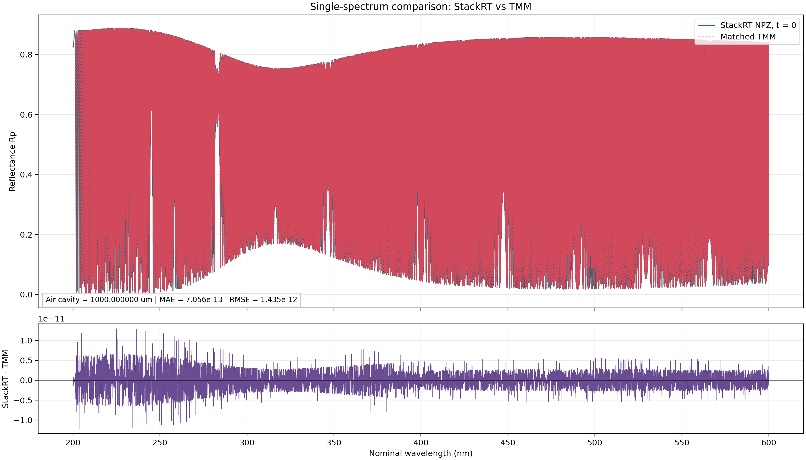

# Dynamic StackRT 与 TMM 初始时刻单光谱对比

## 一句话结论

从 `dynamic_spectra_20260708_112955.npz` 选取 `t=0`、空气腔长 `1000 µm` 的 StackRT 光谱后，在统一频率轴、膜栈、材料光学常数及复折射率符号约定的条件下，独立 TMM 与 StackRT 的反射率光谱在浮点误差范围内一致：MAE 为 `7.06e-13`，最大绝对误差为 `1.29e-11`。

## 背景

`main_dynamic_v2.py` 对 `1 mm` 空气腔施加正弦位移调制，并通过 Lumerical `stackrt` 生成 `Rp(lambda,t)`。本次检查不做反演，只回答一个前向模型问题：在调制初始时刻、所有结构和材料参数保持一致时，本地 TMM 能否复现 NPZ 中的 StackRT 单光谱。

## 数据选择

- 源数据：`../../../work/04_results_and_datasets/dynamic_stackrt_lockin_v2/dynamic_spectra_20260708_112955.npz`
- 选择规则：取 `t_axis` 最小值对应的索引，即 `time_index = 0`
- 初始时间：`t = 0 s`
- 初始空气腔长：`L_t[0] = 1000 µm`
- 光谱字段：`spectra[0, :]`
- 波长点数：`20000`
- 名义波长范围：`200-600 nm`
- 偏振与角度：p 偏振、法向入射，比较 `Rp`

较早的 `dynamic_spectra_20260708_112655.npz` 在 `t=0` 具有完全相同的空气腔长和首帧光谱；本页选取时间戳更新且对应当前 `A_nm = 1` 配置的 `112955` 数据。

## 膜栈与参数口径

从入射侧到基底侧：

| 层 | 复折射率模型 | 厚度 |
|---|---|---:|
| RefReflector | `5.8284` | 半无限入射介质 |
| Air | `1.0` | `1000 µm` |
| HSQ | `1.41` | `40 nm` |
| PSS | `1.50 + 0.05j` | `5 nm` |
| SOC | `1.55 + 0.005/lambda_um^2` | `50 nm` |
| TiO2 | `2.4 + 0.02/lambda_um^2` | `20 nm` |
| Cu | `1.1 + 2.5j` | 半无限基底 |

首层和末层按半无限介质处理，因此它们的数组厚度为 `0` 不表示材料不存在。

## 频率轴与 TMM 约定

### 频率口径

原脚本用下式生成传入 StackRT 的频率：

$$
f=\frac{3.0\times 10^8}{\lambda_{\mathrm{nominal}}}.
$$

StackRT 在这些频率上计算传播相位，因此匹配 TMM 需要按精确真空光速恢复相位波长：

$$
\lambda_{\mathrm{phase}}=\frac{299792458}{f}.
$$

材料折射率数组仍在 `lambda_nominal` 上计算，因为 `main_dynamic_v2.py` 正是这样构造 `n_matrix` 的。对 `1 mm` 空气腔而言，若直接把名义波长同时用于传播相位，会累积显著相位偏差并产生假的光谱失配。

### 复折射率与特征矩阵口径

对 `N=n+ik`，本次匹配采用与 StackRT 数值结果一致的衰减约定，内部有限层矩阵写为

$$
M_j=
\begin{bmatrix}
\cos\delta_j & -i\sin\delta_j/q_j\\
-iq_j\sin\delta_j & \cos\delta_j
\end{bmatrix}.
$$

在法向入射下 s/p 的功率反射率相同，可取 `q_j=N_j`。这个符号必须与时间因子及 `n+ik` 的定义整体一致；不能只替换矩阵中的符号而不检查整套约定。

## 对比结果

| 指标 | 数值 |
|---|---:|
| MAE | `7.0556064502e-13` |
| RMSE | `1.4354938471e-12` |
| 平均有符号误差 | `1.6525090085e-14` |
| 最大绝对误差 | `1.2931683502e-11` |
| 最大误差位置（名义波长） | `225.081254 nm` |
| Pearson 相关系数 | `1.0` |
| StackRT 反射率范围 | `9.3522320e-05` 至 `0.8882501504` |
| TMM 反射率范围 | `9.3522320e-05` 至 `0.8882501504` |

全波段曲线因 `1 mm` 腔产生密集 Fabry-Perot 条纹，在总览图中会呈现近似实色带；下方残差图用于显示两种计算的实际差别。

## 事实、推断与建议

### 已确认事实

- NPZ 首帧确实对应 `t=0` 和 `1000 µm` 空气腔。
- 在与 StackRT 完全一致的参数和数值约定下，TMM 可以复现该首帧光谱。
- 先前出现的 `~0.27` 量级 MAE 主要来自频率/波长换算和复指数符号约定不一致，不是 StackRT 与 TMM 物理理论本身不一致。

### 推断

- 对本次理想、均匀、相干、法向入射模型，StackRT 与独立 TMM 的前向模型差异可以排除到浮点误差量级。
- 这不能自动证明此前反演验证中的 `7-22 nm` 膜厚误差已经消失，因为反演脚本还涉及波长漂移、拟合参数耦合、初值、多解性以及可能不同的 TMM 符号实现。

### 建议

- 后续把 `main_dynamic_v2.py` 中的 `3e8` 改为统一常量 `299792458.0`，并同时保存 `frequency_hz` 或 StackRT 返回的实际波长，避免名义波长与传播波长混用。
- 对 `tmm_inverse_validation_robust.py` 做一次最小前向基准测试，明确其 `n+ik`、时间因子和特征矩阵符号约定，再用于反演结论。
- 高密度 `1 mm` 腔光谱应同时提供局部波长窗口或包络/残差图，不能只凭全波段总览判断两条曲线是否一致。

## 来源路径

- `../../../work/01_simulation_models/01_Lumerical_Workflow/main_dynamic_v2.py`
- `../../../work/04_results_and_datasets/dynamic_stackrt_lockin_v2/dynamic_spectra_20260708_112955.npz`
- `../../../work/04_results_and_datasets/dynamic_stackrt_lockin_v2/single_spectrum_compare_tmm_stackrt/compare_single_spectrum.py`
- `../../../work/04_results_and_datasets/dynamic_stackrt_lockin_v2/single_spectrum_compare_tmm_stackrt/comparison_metrics.json`
- `../../../work/04_results_and_datasets/dynamic_stackrt_lockin_v2/single_spectrum_compare_tmm_stackrt/single_spectrum_compare_tmm_stackrt.csv`
- `../../../work/04_results_and_datasets/dynamic_stackrt_lockin_v2/single_spectrum_compare_tmm_stackrt/single_spectrum_compare_tmm_stackrt.npz`

## 待验证问题

- 是否将精确光速常量和实际波长字段正式写回动态仿真脚本及后续 NPZ 格式。
- 现有反演 TMM 的符号约定修正后，StackRT-vs-TMM 反演误差能下降多少。
- 实际测量链路加入光谱仪线展宽、波长漂移、粗糙度和非均匀性后，当前高密度条纹可见度还能保留多少。

## 2026-07-14 ????????

- ???????`../../../work/04_results_and_datasets/dynamic_stackrt_lockin_v2/single_spectrum_compare_tmm_stackrt/random_cavity_sweep_stackrt_tmm/`
- ???????`../../../work/04_results_and_datasets/dynamic_stackrt_lockin_v2/single_spectrum_compare_tmm_stackrt/random_cavity_sweep_stackrt_tmm_npz/`
- ????`30` ?????????????`20260714`
- ???????`999.079740984-1000.959024227 um`
- ??????? `MAE=8.24e-13`??? `MAE=1.18e-12`??????????? `2.29e-11`??? Pearson ???? `1`

???????? 2026-07-13 ????????? `t=0` ??????????????????????????? 30 ???????StackRT ??? TMM ??????????????????????????????????????????
