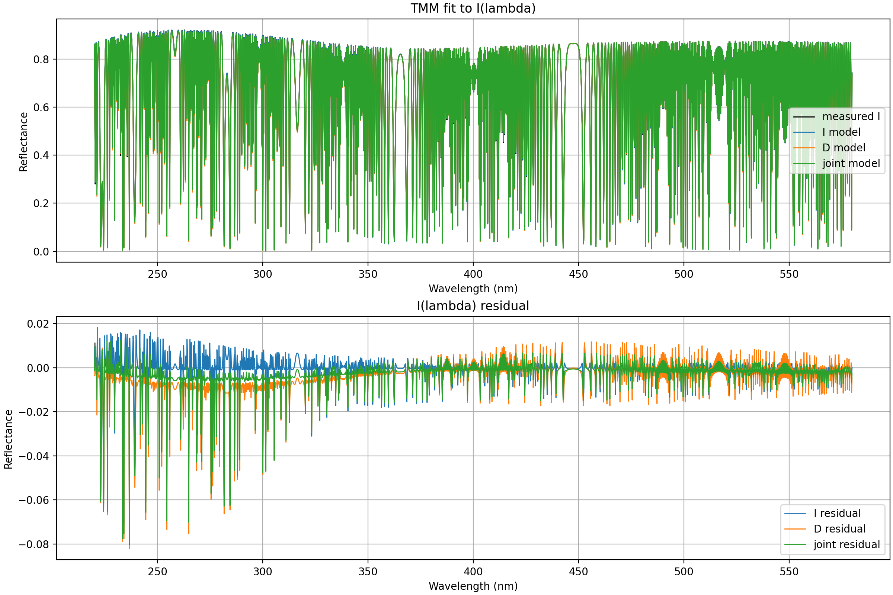
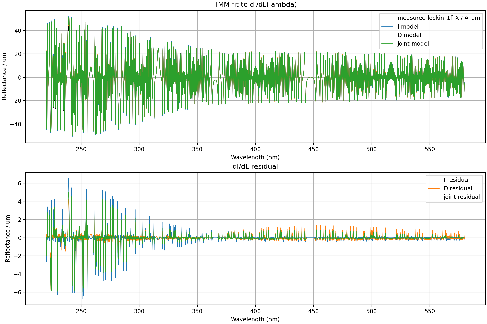
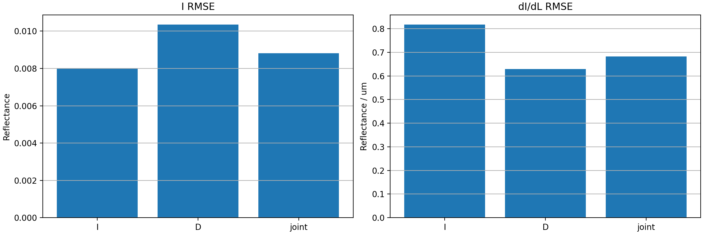

# 高度调制锁相提取与 TMM 联合反演仿真进展

## 一句话结论

当前已完成“StackRT 动态高度调制 -> 1f/2f/3f 数字锁相 -> 匹配 StackRT 约定的 TMM”的前向与信号处理闭环；但 v2 三组反演把仿真真值同时用作首个优化起点和软先验中心，因此 `tmm_joint_inversion_lockin_v2_20260714_165223` 只能证明真值附近的局部拟合能力，不能作为未知参数反演结果。另有 `A=5 nm` 有限幅值观测与静态/小信号模型不一致的问题需要在 v3 中同时处理。

## 2026-07-15 结论更正

v2 中：

```python
guesses = [initial_vector()]
```

而 `initial_vector()` 直接返回 `NOMINAL=[1000,30,10,40,40]`，该值与生成 `dynamic_spectra_20260714_161153.npz` 的真值完全相同。启用 `use_prior=True` 后，残差中又加入以同一 `NOMINAL` 为中心的软先验。因此存在两次真值信息泄漏：

1. 真值作为首个 least-squares 起点。
2. 真值作为软先验中心。

各模式的 rank 1 都来自这个真值起点；其余随机起点与真值相差很大。对应 cost 差异如下：

| 模式 | 真值起点最终 cost | 最优随机起点 cost |
|---|---:|---:|
| I | `2.83` | `1246.10` |
| D | `6.28` | `1745.30` |
| joint | `10.11` | `4203.66` |

这说明当前优化地形存在严重局部极小值问题，而且 `8` 个起点不足。此前报告的膜层 MAE 必须降级为 oracle-assisted 局部闭环指标，不得作为盲反演精度引用。

后续修正与无真值起点验证见：

[[TMM_Joint_Inversion_Lockin_v3_20260715]]

## 研究目标

对空气腔和多层膜系统，联合使用两类观测：

$$
I_{\mathrm{DC}}(\lambda)
$$

以及由空气腔长度调制获得的一阶锁相信号：

$$
D_{1f}(\lambda) \approx \frac{\partial I}{\partial L}(\lambda).
$$

待反演参数为：

$$
\theta=[L_{\mathrm{Air}},d_{\mathrm{HSQ}},d_{\mathrm{PSS}},d_{\mathrm{SOC}},d_{\mathrm{TiO2}}].
$$

这里的 `L` 是 RefReflector 与膜栈之间的空气腔长度。当前仿真并不是对无参考结构做整体刚体平移，因此 `dI/dL` 有明确的干涉相位意义。

## 当前数据流

```text
main_dynamic_v2.py
  -> StackRT 计算 I(t, lambda)
  -> 对每个波长去直流
  -> 1f / 2f / 3f 正交数字锁相
  -> dynamic_spectra_*.npz
  -> tmm_joint_inversion_lockin_v2.py
  -> I-only / D-only / joint 多起点最小二乘
  -> fit_results.csv + multistart_results.csv + fit_summary.json + 诊断图
```

## 动态 StackRT 仿真

### 当前膜栈

从入射侧到基底侧：

| 层 | 当前厚度 | 说明 |
|---|---:|---|
| RefReflector | 半无限 | 入射参考介质 |
| Air | `1000 µm` | 被正弦调制的空气腔 |
| HSQ | `30 nm` | 待反演 |
| PSS | `10 nm` | 待反演 |
| SOC | `40 nm` | 待反演 |
| TiO2 | `40 nm` | 待反演 |
| Cu | 半无限 | 基底 |

### 调制与采样参数

| 参数 | 数值 |
|---|---:|
| 调制频率 `f_mod` | `1000 Hz` |
| 调制幅值 `A` | `5 nm = 0.005 µm` |
| 总采样时间 | `0.01 s` |
| 采样率 | `40000 Hz` |
| 时间点数 `Nt` | `400` |
| 调制周期数 | `10` |
| 波长范围 | `200-600 nm` |
| 波长点数 | `20000` |

最终核查数据：

`../../../work/04_results_and_datasets/dynamic_stackrt_lockin_v2/dynamic_spectra_20260714_161153.npz`

该文件中 `L_t` 的范围为 `999.995-1000.005 µm`，由

$$
A=\frac{\max(L_t)-\min(L_t)}{2}
$$

反算得到 `4.999999999995 nm`，与配置的 `5 nm` 一致。

## 数字锁相实现

对每个波长的时间序列先去除直流：

$$
I_{\mathrm{AC}}(t,\lambda)=I(t,\lambda)-\langle I(t,\lambda)\rangle_t.
$$

对第 `h` 次谐波生成正交参考并计算：

$$
X_h(\lambda)=\frac{2}{N_t}\sum_t I_{\mathrm{AC}}(t,\lambda)
\sin(2\pi h f_{\mathrm{mod}}t),
$$

$$
Y_h(\lambda)=\frac{2}{N_t}\sum_t I_{\mathrm{AC}}(t,\lambda)
\cos(2\pi h f_{\mathrm{mod}}t),
$$

$$
R_h=\sqrt{X_h^2+Y_h^2},\qquad
\phi_h=\operatorname{atan2}(Y_h,X_h).
$$

由于代码中的 `X/Y` 已包含 `2/Nt` 归一化，小信号极限下有：

$$
X_{1f}(\lambda)\approx A\frac{\partial I}{\partial L}.
$$

因此反演脚本使用带符号通道：

$$
\left(\frac{\partial I}{\partial L}\right)_{\mathrm{meas}}
=\frac{X_{1f}}{A}.
$$

`main_dynamic_v2.py` 另外保存 `dIdL_1f=R_1f/A`。它是非负幅值，适合画响应强度，但丢失导数符号，不应直接替代联合反演中的 `X_1f/A`。

### NPZ 当前字段

```text
t_axis, wavelengths, L_t, spectra,
lockin_1f_X, lockin_1f_Y, lockin_1f_R, lockin_1f_phase,
lockin_2f_X, lockin_2f_Y, lockin_2f_R, lockin_2f_phase,
lockin_3f_X, lockin_3f_Y, lockin_3f_R, lockin_3f_phase,
dIdL_1f
```

当前 NPZ 尚未显式保存 `A_nm`、`f_Hz`、膜层厚度、材料模型版本和代码版本。幅值虽然可由 `L_t` 反算，但后续应把这些元数据直接写入 NPZ，避免数据与脚本配置不同步。

## StackRT 与 TMM 约定闭环

独立 TMM 必须复现动态 StackRT 数据生成时的数值口径：

- 频率轴：`f = 3e8 / lambda_nominal`。
- 传播相位波长：`lambda_phase = 299792458 / f`。
- 材料折射率仍在 `lambda_nominal` 上求值。
- 法向入射导纳：`q = n`。
- 复折射率：`n + i*k`。
- 特征矩阵非对角项采用 `-i` 符号。

旧数据的单光谱闭环结果为 `MAE = 7.06e-13`、`RMSE = 1.44e-12`、相关系数 `1.0`，见：

[[04_Experiments/Simulation_Reports/Dynamic_StackRT_TMM_Single_Spectrum_20260713]]

对新膜栈数据 `dynamic_spectra_20260714_161153.npz` 的再次核查同样确认：新厚度 `30/10/40/40 nm` 能复现 StackRT 首帧和 1f 通道；旧厚度不能复现。因此膜层参数同步问题已经解决。

## 联合反演 v2

反演脚本：

`../../../work/02_analysis_code/tmm_joint_inversion_lockin_v2.py`

### 三组对照

| 模式 | 数据残差 | 说明 |
|---|---|---|
| `I` | `I_model - I_meas` | 光谱单独反演 |
| `D` | `dIdL_model - dIdL_meas` | 一阶锁相导数单独反演 |
| `joint` | 两个残差块拼接 | 光谱与导数联合反演 |

三组模式在当前运行中都启用了名义参数软先验，因此 `I-only` 不是完全无先验的纯光谱反演。

### 当前观测构造

- `I_meas = mean(spectra, axis=0)`：使用全部 `400` 个时刻的平均光谱，不是任意单一时刻。
- `dIdL_meas = lockin_1f_X / A_um`：使用有符号 1f 同相通道。
- 拟合波段：`220-580 nm`。
- `stride = 10`，最终使用 `1800` 个波长点。
- TMM 光谱模型：静态中心腔长下的 `I(L0)`。
- 导数模型：`delta_L = 0.001 µm = 1 nm` 的中心差分。
- 优化器：`scipy.optimize.least_squares`，`soft_l1` 损失。
- 多起点：每种模式 `8` 次，**第一组为名义真值，其余 `7` 组在 bounds 内随机生成**。

### 多起点 rank 规则

`multistart_results.csv` 中的 `rank` 在每个模式内部从 `1` 到 `8` 重新编号：

1. 所有 `success=True` 的尝试排在 `success=False` 之前。
2. 同一成功状态内按 robust cost 从小到大排序。
3. `rank=1` 是写入 `fit_results.csv` 的最终结果。

v2 已修正“未收敛结果因中间 cost 较低而被选为最优解”的问题。需要注意：`success=True` 只表示 SciPy 满足终止条件，不等于参数一定物理正确；不同模式的 cost 由不同残差块构成，也不能直接横向比较。

## 关键调试历程

### 1. 前向 TMM 约定不一致

早期 TMM 与 StackRT 的差异主要来自频率/相位波长和复折射率矩阵符号不一致。v2 按上述约定修正后，单光谱前向闭环达到浮点误差级。

### 2. 膜层参数未同步

`tmm_joint_inversion_lockin_v2_20260714_155610` 对应的 NPZ 实际仍是旧膜栈 `40/5/50/20 nm`，而反演脚本名义参数已经改为 `30/10/40/40 nm`。旧、新 NPZ 首帧曾完全相同，证明当时数据是在保存仿真脚本前生成的。

重新运行后生成的 `dynamic_spectra_20260714_161153.npz` 已确认采用新膜栈，参数同步问题关闭。

### 3. 调制幅值未同步

中间运行曾用 `A=5 nm` 的 NPZ 配合反演默认 `A=1 nm`，使 `X_1f/A` 被放大 5 倍，D 残差出现数量级错误。最终结果目录 `tmm_joint_inversion_lockin_v2_20260714_165223` 的 `fit_summary.json` 已明确记录 `amplitude_nm = 5.0`，幅值口径已修正。

## v2 三组对照结果：仅限局部闭环诊断

结果目录保留用于诊断，但不作为未知参数反演证据：

`../../../work/04_results_and_datasets/tmm_joint_inversion_lockin_v2_20260714_165223/`

真值：Air `1000 µm`，HSQ/PSS/SOC/TiO2 为 `30/10/40/40 nm`。

| 模式 | Air (`µm`) | HSQ (`nm`) | PSS (`nm`) | SOC (`nm`) | TiO2 (`nm`) | `RMSE_I` | `RMSE_dIdL` |
|---|---:|---:|---:|---:|---:|---:|---:|
| I | 1000.000114 | 30.069 | 11.375 | 38.897 | 39.770 | 0.008008 | 0.81734 |
| D | 1000.001170 | 28.805 | 16.779 | 34.610 | 39.607 | 0.010350 | 0.62943 |
| joint | 1000.000699 | 29.589 | 14.638 | 36.206 | 39.575 | 0.008819 | 0.68182 |

真值起点对应结果的膜层绝对误差平均值：

| 模式    |    四层膜 MAE |
| ----- | ---------: |
| I     | `0.695 nm` |
| D     | `3.439 nm` |
| joint | `2.317 nm` |

上述数值不能作为盲反演精度，因为三个 rank 1 均由真值起点获得。若排除该起点，当前随机 multistart 没有找到同一低 cost 解盆地。







### 结果解释

**已确认事实：**

- 最终数据、膜层真值和反演名义参数已经同步。
- 最终反演使用正确的 `A=5 nm`，D 残差不再有 5 倍幅值错误。
- 三组 rank 1 均来自真值起点，不能用于比较 I-only、D-only 与 joint 的未知参数恢复能力。
- 排除真值起点后，其余结果普遍偏离真值并常落到 bounds 附近，说明当前全局搜索能力不足。
- Jacobian 条件数分别约为：I `1.48e4`、D `2.02e4`、joint `1.81e4`。当前 joint 并未相对 I 降低条件数。

**原因判断：**

数据由有限幅值正弦调制生成，而反演模型没有复现相同测量算子：

1. `I_meas` 是完整周期的时间平均，模型却使用静态 `I(L0)`。
2. `dIdL_meas` 是 `A=5 nm` 的有限幅值 1f Fourier 系数除以 `A`，模型却使用 `1 nm` 步长的局部中心差分。
3. 优化器会移动膜厚去吸收这两类系统性模型误差，因此 joint 可能比 I-only 更偏。

在 `220-580 nm`、`stride=10` 的拟合网格上：

- `mean_t[I(t,lambda)]` 与首帧 `I(L0)` 的 RMSE 为 `0.008326`。
- 真值处中心差分导数与 `X_1f/A` 的 RMSE 为 `0.87585 /µm`。
- 导数相对 RMS 失配为 `6.31%`，相关系数仍有 `0.99866`。

这说明导数的整体结构是正确的，但幅值和局部形状已有足以推动参数偏移的有限调制非线性。

## 早期小幅值基准

旧膜栈 `40/5/50/20 nm`、`A=1 nm` 的结果位于：

`../../../work/04_results_and_datasets/tmm_joint_inversion_lockin_v2_20260714_152135/`

| 模式 | 四层膜 MAE | `RMSE_I` | `RMSE_dIdL` |
|---|---:|---:|---:|
| I | `0.024 nm` | `0.000285` | `0.01618` |
| D | `0.037 nm` | `0.000351` | `0.003770` |
| joint | `0.022 nm` | `0.000326` | `0.005675` |

该结果说明小幅值条件下现有近似可以形成很好的数值闭环，但它是理想、无噪声、先验中心等于真值，并且首个初值就是名义真值的仿真。它不能直接解释为实验可达到 `0.02 nm` 精度。

## 当前结论边界

### 已完成验证

- StackRT 动态光谱生成与 1f/2f/3f 锁相字段保存。
- 1f 有符号通道 `X_1f/A` 的反演接入。
- StackRT 与独立 TMM 的单时刻前向模型一致性。
- I-only、D-only、joint 三组统一参数范围和多起点反演。
- 未收敛尝试不能覆盖已收敛最优解。
- 膜层参数和调制幅值同步问题的定位与修正。

### 尚未证明

- `A=5 nm` 条件下 joint 优于 I-only。
- 加入噪声、波长漂移、线展宽、材料色散误差后仍能稳定反演。
- 调制通道能在真值不位于先验中心时可靠解除多解。
- 当前结果可直接外推到真实 HSQ/SOC/Hard Mask/Si 实验精度。
- 不提供真值初值时，现有优化器能够从 bounds 内恢复正确参数。

## 下一步方案

> [!NOTE] 2026-07-15 状态
> v3 已实现有限幅值 forward model、每种模式独立差分进化和 32 起点局部精修，并在当前理想数据上达到 `32/32` 收敛。以下条目中与该实现重复的部分已完成，噪声、真值随机化和扩大 bounds 仍待验证。

### 优先级 1：让反演 forward model 复现测量算子

对每组候选参数，直接生成与数据相同的相位采样：

$$
L(t)=L_0+A\sin(2\pi f t),
$$

再由同一组模拟序列计算：

$$
I_{\mathrm{model}}(\lambda)=\langle I(t,\lambda)\rangle_t,
$$

$$
D_{\mathrm{model}}(\lambda)=\frac{X_{1f,\mathrm{model}}(\lambda)}{A}.
$$

这样可以直接消除当前 `A=5 nm` 下的静态/小信号近似偏差。计算量可通过每周期 `16-32` 个相位点和周期对称性控制。

### 优先级 2：幅值扫描

固定膜栈，比较 `A = 0.5, 1, 2, 5, 10 nm`：

- 小信号中心差分与有限幅值 1f 的偏差。
- 1f、2f、3f 能量比。
- I/D/joint 的参数误差和条件数。
- 在噪声下信号增益与非线性偏差的折中。

### 优先级 3：严格可观测性测试

- 真值随机偏离名义先验，不再让第一初值等于真值。
- 分别运行有先验和无先验版本。
- 扩大 multistarts，并报告命中真值盆地的比例。
- 比较 Jacobian/Fisher 条件数、参数相关系数和 profile likelihood。

### 优先级 4：数据格式完善

建议后续 NPZ 直接保存：

```text
modulation_amplitude_nm
modulation_frequency_hz
sampling_rate_hz
stack_layer_names
stack_thickness_um
material_model_id
frequency_axis_hz
generator_script_version
```

反演脚本应优先从 NPZ 读取幅值，并在命令行手动值与 NPZ 元数据冲突时中止或显式报警。

## 来源路径

- 动态 StackRT 与锁相代码：`../../../work/01_simulation_models/01_Lumerical_Workflow/main_dynamic_v2.py`
- 联合反演 v2：`../../../work/02_analysis_code/tmm_joint_inversion_lockin_v2.py`
- 最终同步 NPZ：`../../../work/04_results_and_datasets/dynamic_stackrt_lockin_v2/dynamic_spectra_20260714_161153.npz`
- 单光谱前向闭环：`../../../work/04_results_and_datasets/dynamic_stackrt_lockin_v2/single_spectrum_compare_tmm_stackrt/`
- 小幅值基准：`../../../work/04_results_and_datasets/tmm_joint_inversion_lockin_v2_20260714_152135/`
- 当前最终对照：`../../../work/04_results_and_datasets/tmm_joint_inversion_lockin_v2_20260714_165223/`

## 待验证问题

- 完整有限幅值 forward model 能否使 `A=5 nm` 的真值残差回到数值误差量级。
- 在真实噪声水平下，最佳调制幅值是 `1 nm`、`5 nm` 还是其他值。
- 2f/3f 是否只作为非线性诊断，还是应作为额外反演通道。
- 当前 `PSS` 与 `SOC` 偏差是否主要由有限幅值失配引起，还是也存在材料参数敏感度共线问题。
