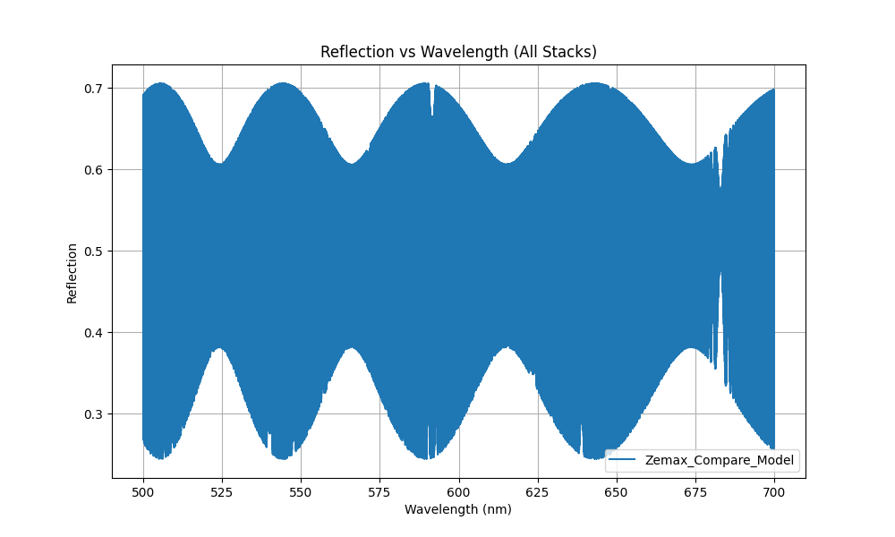
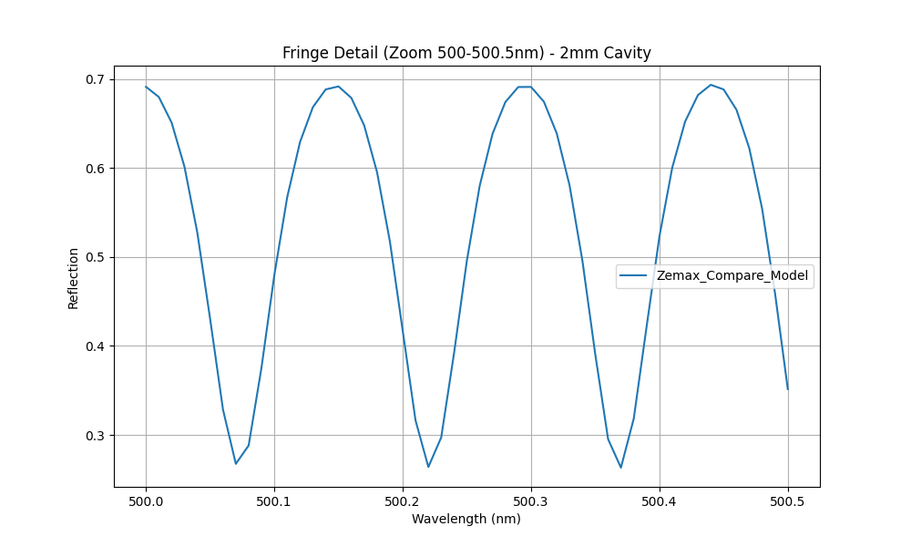

# Lumerical STACK Simulation Report

## 1. Model Overview
This report summarizes the 1D planar film stack optical modeling for focus and leveling research.
**New Feature**: 3-Surface Zemax Equivalent Model with 2mm & 1um cavities.

## 2. Summary Statistics & Fringe Analysis
| Stack Name | Avg R | Max R | Visibility | Fringe Period (nm) | Aliasing Risk | Peak Count |
|------------|-------|-------|------------|--------------------|---------------|------------|
| Zemax_Compare_Model | 0.5173 | 0.7055 | 0.4856 | 0.0302 | True | 6628 |

## 3. Key Analysis Insights
- Zemax equivalent 3-surface model correctly evaluated using TMM.
- The 2mm cavity creates ultra-high frequency fringes requiring 0.01nm resolution.

## 4. Visualizations
### Broadband Spectrum

### High-Frequency Fringe Detail (500nm Zoom)

## 5. Limitations & Future Work
- Model includes 2mm virtual cavity, requiring very high resolution (0.01nm).
- FDTD visualization of 2mm gap is scaled down to 2um to allow mesh generation.
