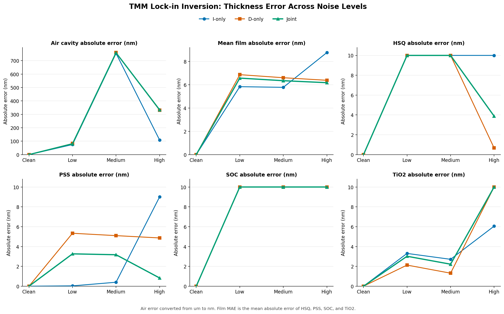

# TMM 锁相联合反演：不同噪声等级拟合误差对比

## 一句话结论

clean 数据可实现数值精度闭环；加入 v4 复合扰动后，Air 误差达到 `75-761 nm`，膜层平均绝对误差约为 `6-7 nm`，且多个膜层结果触及拟合边界。误差不随 low、medium、high 严格单调，说明单次随机 realization 的系统扰动强度不等同于噪声等级标签。

## 拟合误差对比

图中 Air 误差由 `fit_results.csv` 的 `error_Air_um` 转换为 nm；其余膜层直接使用 nm。所有曲线均采用绝对误差，膜层 MAE 为 HSQ、PSS、SOC、TiO2 四层绝对误差的平均值。

## Joint 模式数值

| 噪声等级 | Air 绝对误差 (nm) | HSQ (nm) | PSS (nm) | SOC (nm) | TiO2 (nm) | 膜层 MAE (nm) |
|---|---:|---:|---:|---:|---:|---:|
| clean | 3.41e-10 | 1.85e-09 | 1.53e-09 | 1.14e-12 | 2.21e-10 | 9.00e-10 |
| low | 80.725 | 10.000 | 3.262 | 10.000 | 3.020 | 6.571 |
| medium | 758.973 | 10.000 | 3.172 | 10.000 | 2.219 | 6.348 |
| high | 333.902 | 3.878 | 0.832 | 10.000 | 10.000 | 6.177 |

## 关键事实

- 四个结果目录已分别核对为 clean、low、medium、high 输入。
- clean 下 I-only、D-only、Joint 均恢复真值，误差处于数值精度量级。
- low 和 medium 的 Joint 结果中，HSQ 达到 `40 nm` 上界、SOC 达到 `30 nm` 下界。
- high 的 Joint 结果中，SOC 达到 `50 nm` 上界、TiO2 达到 `30 nm` 下界。
- medium 的 Air 误差大于 high，并不表示 high 配置更温和；每个等级当前只有一个随机 realization，角度、波长零点和 n/k 扰动的实际抽样值并不严格单调。

## 适用条件

本页比较的是当前四个指定目录中的 rank-1 结果，只反映单次噪声 realization。若要评价算法随噪声等级的统计鲁棒性，需要每个等级使用多个随机种子，并统计误差中位数、分位区间和触边率。

## 来源路径

- `../../../work/04_results_and_datasets/tmm_joint_inversion_lockin_v3_20260717_152324/`
- `../../../work/04_results_and_datasets/tmm_joint_inversion_lockin_v3_20260717_152530/`
- `../../../work/04_results_and_datasets/tmm_joint_inversion_lockin_v3_20260717_154420/`
- `../../../work/04_results_and_datasets/tmm_joint_inversion_lockin_v3_20260717_161806/`
